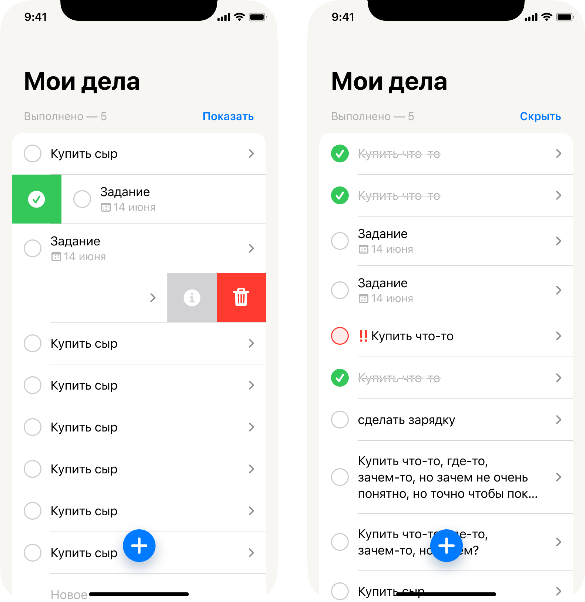
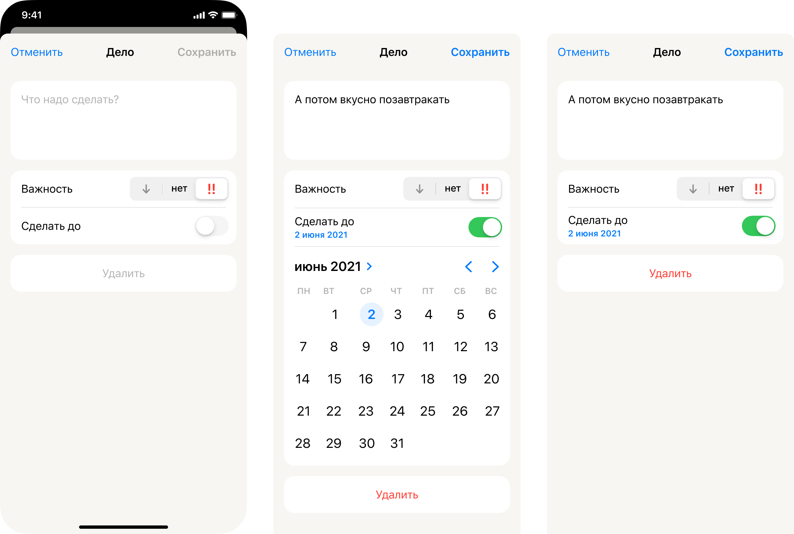
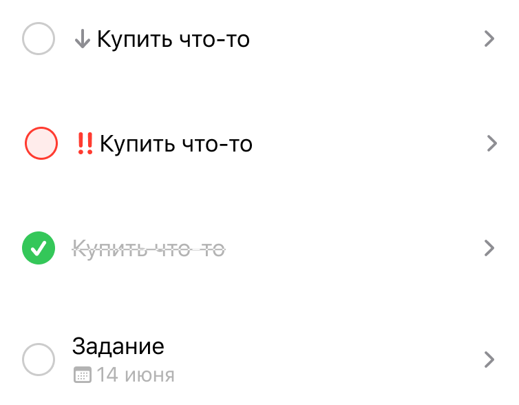
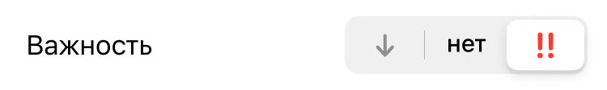

# Таск-менеджер
____
Простейшее приложение с использованием Spring MVC + HTML(Thymeleaf) + JS + CSS(custom styles, bootstrap 5)
____

## Сценарии использования
____
Основная модель системы это задача, которая характеризуется следующим атрибутным составом:
- ID (назначается автоматически при создании)
- Название
- Детальное описание(не обязательно для заполнения)
- Приоритет(Нет, Низкий, Высокий)
- Дата и время создания
- Дата и время изменения(проставляется, когда информация о деле была отредактирована)
- Дата и время выполнения(проставляется, когда человек отметил дело выполненным)
- Дедлайн(не обязательно для указания)
- Отметка о выполнении
- Создатель(Пользователь, создавший задачу, так как у каждого они свои)

Система должна обеспечивать следующий функционал:
- [x] Авторизация и регистрация пользователя
- [x] Просмотр списка задач
- [ ] Удаление задачи
- [ ] Просмотр детальной страницы задачи
- [ ] Редактирование задачи
- [ ] Отметить задачу выполненным

Требования к реализации:
- [ ] Явное различие задач в списке, в зависимости от характеристик(Есть или нет дедлайна, степень приоритета)
- [ ] Возможность отметить дело выполненным, после чего дело явно отличается от невыполненных в списке по дизайну(зачеркнуто на макетах)
- [ ] Обязательное применение стилей 
- [ ] Адаптивный для смартфонов интерфейс(на смартфоне в 480 px все должно быть красиво)
- [ ] Реализовать кнопку для переключения темы между темной и светлой
ДОПЫ: 
- [ ] Постраничный просмотр списка дел(пагинация)
- [ ] Сортировка списка дел(по сроку дедлайна, по приоритету, по дате создания и т.д. - достаточно 2 категории)
- [ ] Фильтрация списка дел(например, можно сделать по приоритету, с дедлайном и без)

____
## Примеры макетов
____
Все иконки можно найти в каталоге /assets  
Макеты для мобильной версии приложения, не содержат возможности фильтрации, сортировки, пагинации  
Нужны лишь для примерного понимания и представления того, что нужно сделать

#### Общее представление страниц

#### Отображение в списке дел

#### Свайп не надо отображать, можно эти кнопки сделать фиксированными справа вместо стрелки

